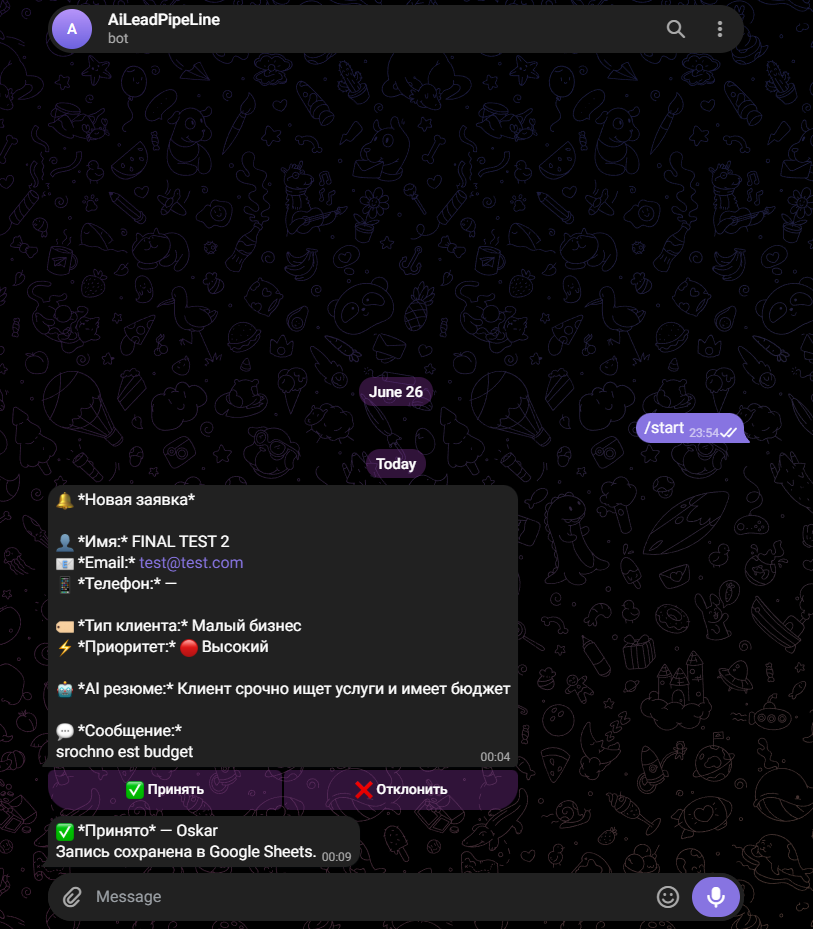

# AI Lead Pipeline

Automated lead processing system with AI analysis and manager approval via Telegram.

## Demo



## How it works

1. Client submits a form (Tally or any webhook source)
2. AI analyzes the lead — classifies client type, priority, writes a summary
3. System checks the shift schedule and sends a notification to the on-duty manager in Telegram
4. Manager taps **Accept** or **Reject** directly in Telegram
5. Lead is saved to Google Sheets with the decision and manager name

```
Form submission → FastAPI → AI (OpenRouter) → Telegram notification
                                                      ↓
                                            Manager taps Accept/Reject
                                                      ↓
                                              Google Sheets CRM
```

## Features

- AI lead qualification — client type, priority (High/Medium/Low), one-line summary
- Shift-based routing — notifies the right manager based on day and hour
- Interactive Telegram approval — inline buttons, no extra app needed
- Google Sheets as CRM — all leads stored with full details and decision

## Stack

- Python 3.11+
- FastAPI
- OpenRouter API (LLM)
- Telegram Bot API
- Google Sheets API (gspread)

## Setup

**1. Clone the repo**
```bash
git clone https://github.com/Shpuntyara/lead-pipeline.git
cd lead-pipeline
```

**2. Create virtual environment and install dependencies**
```bash
python -m venv venv
venv\Scripts\activate      # Windows
pip install -r requirements.txt
```

**3. Configure environment**
```bash
cp .env.example .env
```

Fill in `.env`:
```
TELEGRAM_BOT_TOKEN=your_bot_token
OPENROUTER_API_KEY=your_openrouter_key
GOOGLE_SPREADSHEET_ID=your_spreadsheet_id
GOOGLE_SHEET_NAME=Leads
GOOGLE_SERVICE_ACCOUNT_FILE=service_account.json
```

**4. Add Google Sheets access**

- Create a service account in Google Cloud Console
- Enable Google Sheets API
- Download the JSON key → save as `service_account.json` in project root
- Share your Google Sheet with the service account email (Editor role)

**5. Configure shift schedule**

Edit `schedules.json` to set which manager (by Telegram chat_id) is on duty at what hours:
```json
{
  "monday": {"0-12": 111111111, "12-24": 222222222},
  "tuesday": {"0-12": 222222222, "12-24": 111111111}
}
```

**6. Run the server**
```bash
python -m uvicorn src.main:app --port 8000
```

**7. Expose locally with ngrok**
```bash
ngrok http 8000
```

Register Telegram webhook:
```bash
curl -X POST "https://api.telegram.org/bot<TOKEN>/setWebhook" \
  -H "Content-Type: application/json" \
  -d '{"url": "https://your-ngrok-url.ngrok-free.app/bot-callback"}'
```

Point your form webhook to: `https://your-ngrok-url/webhook`

## Google Sheets columns

| Date | Name | Email | Phone | Message | Client Type | Priority | AI Summary | Status | Manager |
|------|------|-------|-------|---------|-------------|----------|------------|--------|---------|
